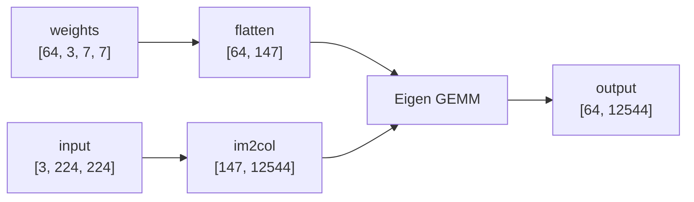

# Conv2d

The current Conv2d validation target is ResNet-18 `conv1`:

```text
input:   [3, 224, 224]
weight:  [64, 3, 7, 7]
stride:  2
padding: 3
output:  [64, 112 * 112]
```

## Direct

`conv2d_naive_direct` computes each output element directly:

```text
for oc
  for oy
    for ox
      sum = bias[oc]
      for ic
        for ky
          for kx
            sum += input[ic, iy, ix] * weight[oc, ic, ky, kx]
```

This path is simple and avoids a large temporary matrix. It is also slow for
larger convolution shapes because it does scalar work in deeply nested loops.

## Eigen

`conv2d_im2col_eigen` lowers input patches into a matrix, flattens filters into
a weight matrix, then uses Eigen matrix multiplication.

For `conv1`:



```text
columns: [3 * 7 * 7, 112 * 112] = [147, 12544]
weights: [64, 147]

GEMM:    [64, 147] * [147, 12544] = [64, 12544]
```

This path uses more temporary memory, but it turns the convolution into a matrix
multiply that Eigen can optimize.

The default `conv2d` wrapper currently calls `conv2d_naive_direct`. Benchmarks
call explicit variant names.

## Validation

`make test-conv2d` compares `conv2d_naive_direct`, `conv2d_im2col_eigen`, and
the default wrapper against the exported PyTorch `conv1` output.
