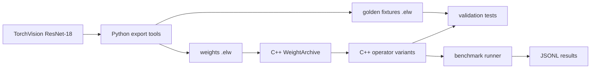

# dlinf

`dlinf` is a small C++ inference framework with PyTorch export tooling.
It loads public ResNet-18 weights, runs selected layers in C++, and compares
the outputs against PyTorch-generated reference tensors.

The project is pretty narrow at the moment:

- export TorchVision ResNet-18 weights and reference tensors into `.elw` files;
- load float32 tensors from C++;
- implement and validate core inference operators;
- compare naive loops with Eigen-backed variants;
- measure kernel runtimes through a JSONL benchmark runner.

It is not aimed at production, but at benchmarking various inference implementations.

## Data Flow



## Current Scope

Implemented operators:

| Operation | Direct | Eigen |
|---|---|---|
| `Linear` | `linear_naive` | `linear_eigen` |
| `Conv2d` | `conv2d_naive_direct` | `conv2d_im2col_eigen` |
| `BatchNorm2d` | `batchnorm2d_direct` | - |
| ReLU | - | `relu_inplace` |

Current reference model surface:

| Model part | Status |
|---|---|
| ResNet-18 `fc` | validated |
| ResNet-18 `conv1` | validated |
| ResNet-18 `conv1 -> bn1` | validated |

## Build And Run

Install Eigen3 first. Then generate or refresh the Python artifacts:

```bash
uv sync
uv run python tools/audit_resnet18.py --output-dir artifacts/resnet18
uv run python tools/export_linear_golden.py --output-dir artifacts/resnet18
uv run python tools/export_conv_golden.py --output-dir artifacts/resnet18
uv run python tools/export_conv_bn_golden.py --output-dir artifacts/resnet18
```

Build and run the validation targets:

```bash
make test-linear
make test-conv2d
make test-conv-bn
```

Run the kernel benchmark harness:

```bash
make bench-kernels
```

The benchmark command prints JSONL, one record per measured case.
