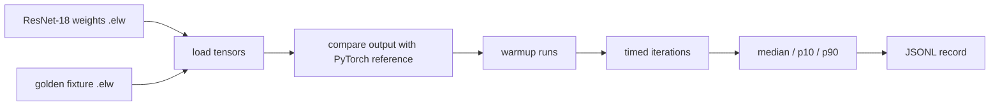
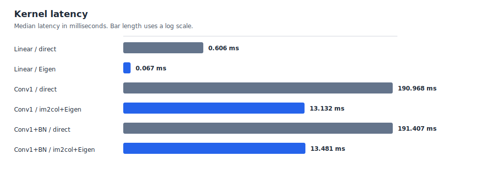
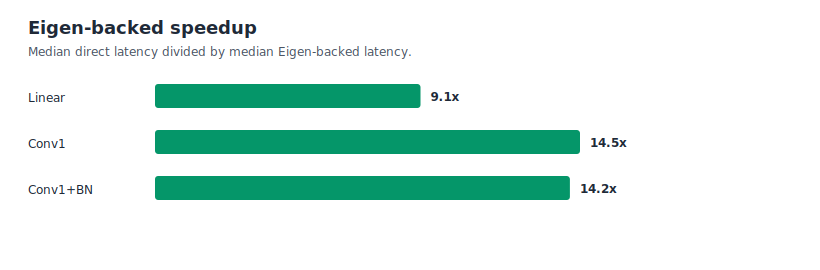

# Performance

The repository includes a small benchmark runner for the currently validated
kernel variants. It prints one JSON object per measured case.

```bash
make bench-kernels
```

Save a benchmark artifact and regenerate the documentation plots:

```bash
make bench-kernels-save
make plot-benchmarks
```

Custom run:

```bash
./build/bench_kernels --warmup 5 --iterations 30
```

The default run uses `warmup=2` and `iterations=10`. That is enough for
development feedback. Use larger iteration counts for numbers intended for a
writeup.

The baseline (consumer laptop based) result is in:

```text
benchmarks/results/local_laptop_kernel_bench.jsonl
```

## Terms

In this repository, a benchmark **kernel** is one measured inference operation
or small composed block, such as `linear_fc`, `conv1`, `conv1_bn1`, or `layer1.0`. It does
not mean an operating-system kernel, CUDA kernel, or standalone GPU kernel.

**Kernel latency** is the elapsed wall-clock time for one invocation of a
specific implementation variant. Warmup runs are excluded. The reported
`median_ms`, `p10_ms`, and `p90_ms` values are computed from the timed
iterations in one benchmark run.

## Threading

The current benchmark records use `threads=1`.

That means the measured C++ operator implementations do not spawn worker
threads, and the default Makefile build does not enable OpenMP or pthread-based
parallelism. GCC `-O3` may inline functions, unroll loops, and emit SIMD
instructions where it can prove that is valid, but it does not automatically
split these loops across CPU cores.

So the current comparison is single-threaded direct/naive code versus
single-threaded Eigen-backed code. Eigen may still use vectorized CPU
instructions inside one thread.

## Benchmark Flow



## Output Format

Each output line is JSONL:

```json
{"op":"conv1","impl":"conv2d_im2col_eigen","precision":"fp32","threads":1,"warmup":2,"iterations":10,"median_ms":16.743340,"p10_ms":16.627185,"p90_ms":17.139967}
```

Important fields:

| Field | Meaning |
|---|---|
| `op` | Logical benchmark case |
| `impl` | Implementation variant |
| `median_ms` | Main latency number |
| `p10_ms` / `p90_ms` | Faster/slower side of the timed samples |
| `max_abs_error` | Error against PyTorch reference output |
| `checksum` | Output sum used as a sanity value |
| `input_shape` / `weight_shape` | Tensor dimensions |
| `compiler_flags` | Build flags used for the run |
| `host` / `cpu_model` | Local machine metadata |

## Current Local Run

These are local measurements from one laptop:

```text
CPU: 11th Gen Intel(R) Core(TM) i7-11800H @ 2.30GHz
Compiler flags: -std=c++17 -O3 -Wall -Wextra -Wpedantic
Warmup: 5
Iterations: 30
Threads: 1
```

The first chart is a **kernel latency** chart: each bar is the median elapsed
time for one measured operator/block implementation. The latency chart uses a
log scale because the direct Conv2D implementation is much slower than the
linear and Eigen-backed cases.





