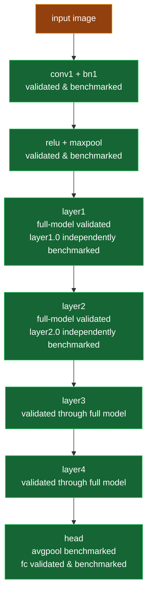

# ResNet-18 Coverage

This page tracks which parts of TorchVision ResNet-18 have exported golden
fixtures, C++ validation, and benchmark coverage.

The diagram is intentionally staged instead of module-by-module. It shows
validation/export coverage at a readable scale, not a full neural-network graph
executor.



Legend:

| Color | Meaning |
|---|---|
| Green | Stage is validated in C++, either independently or through the full model. |
| Yellow | Fixture/export input exists, but it is not an independently validated operator stage. |
| Gray | Planned only. |

## Nomenclature

TorchVision ResNet-18 has a bespoke front end, a repeated block body, and a
small classification head:

```text
input
-> conv1 -> bn1 -> relu -> maxpool
-> layer1 -> layer2 -> layer3 -> layer4
-> avgpool -> flatten -> fc
```

The front end is often called the **stem**. It is not a BasicBlock. In
TorchVision ResNet-18, the stem starts with a `7x7` stride-2 convolution, then
BatchNorm, ReLU, and MaxPool.

The recurring body consists of four **layer groups**:

| Layer group | Blocks | Role |
|---|---|---|
| `layer1` | `layer1.0`, `layer1.1` | First BasicBlock group; keeps 64 channels. |
| `layer2` | `layer2.0`, `layer2.1` | Downsamples and increases to 128 channels. |
| `layer3` | `layer3.0`, `layer3.1` | Downsamples and increases to 256 channels. |
| `layer4` | `layer4.0`, `layer4.1` | Downsamples and increases to 512 channels. |

ResNet-18 uses two kinds of BasicBlock:

| Block kind | Examples | Skip path |
|---|---|---|
| Identity BasicBlock | `layer1.0`, `layer1.1`, `layer2.1`, `layer3.1`, `layer4.1` | Adds the original input tensor directly. |
| Projection BasicBlock | `layer2.0`, `layer3.0`, `layer4.0` | Uses a `1x1` downsample convolution plus BatchNorm on the skip path. |

The identity BasicBlock exporter defaults to `layer1.0`. The projection
BasicBlock exporter currently targets `layer2.0`. Full-model validation runs
the remaining identity and projection blocks through the composed ResNet-18
pipeline, even where separate per-block fixtures have not been added.

## Coverage Table

| ResNet-18 part | Golden exporter | C++ validation | Benchmark coverage | Status |
|---|---|---|---|---|
| `fc` | `tools/export_linear_golden.py` | `make test-linear` | `make bench-kernels` | Validated and benchmarked |
| `conv1` | `tools/export_conv_golden.py` | `make test-conv2d` | `make bench-kernels` | Validated and benchmarked |
| `conv1 -> bn1` | `tools/export_conv_bn_golden.py` | `make test-conv-bn` | `make bench-kernels` | Validated and benchmarked |
| `layer1.0` identity BasicBlock | `tools/export_basicblock_golden.py` | `make test-basicblock` | `make bench-kernels` | Validated and benchmarked |
| `maxpool` (stem) | `tools/export_maxpool_golden.py` | `make test-maxpool` | `make bench-kernels` | Validated and benchmarked |
| `avgpool` (head) | `tools/export_avgpool_golden.py` | `make test-avgpool` | `make bench-kernels` | Validated and benchmarked |
| `layer2.0` projection BasicBlock | `tools/export_projection_basicblock_golden.py` | `make test-projection-basicblock` | `make bench-kernels` | Validated and benchmarked |
| Full ResNet-18 | `tools/export_resnet18_golden.py` | `make test-resnet18` | `make bench-models` | Validated and benchmark-wired |
| Remaining BasicBlocks | Covered by `tools/export_resnet18_golden.py` | `make test-resnet18` | Not independently benchmarked | Validated through full pipeline |

## Export Pattern

Golden fixture archives contain only the deterministic block input and expected
PyTorch output. Model parameters stay in the full ResNet-18 weight archive:

```text
artifacts/resnet18/resnet18_imagenet1k_v1.elw
```

This keeps each fixture small and makes the C++ tests prove that they can load
weights from the same archive used by other validation targets.
